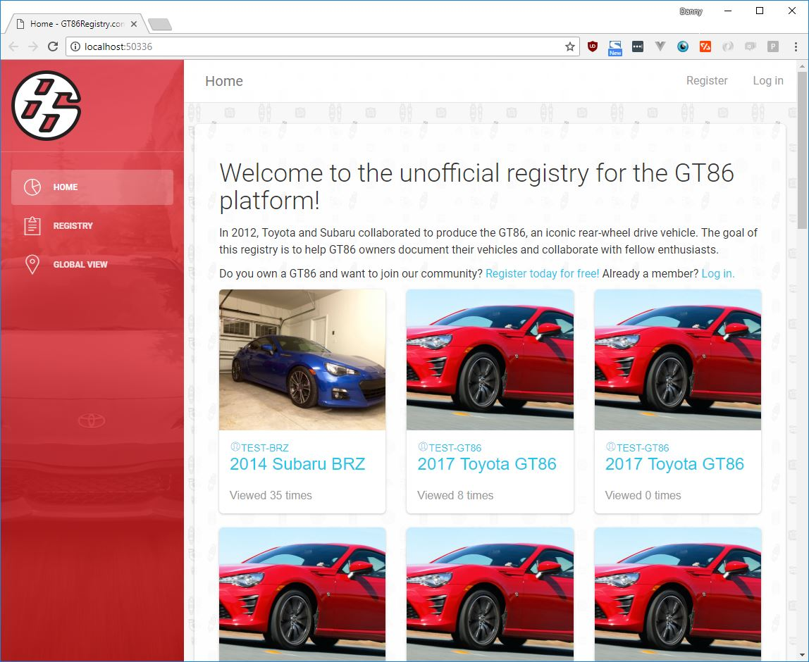
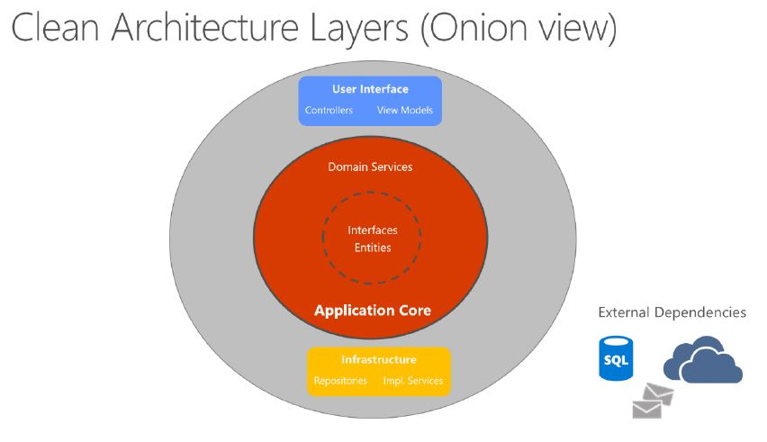

# GT86Registry.com
A project to test out the *current* iterations of .NET Core, Web API, and some fun Javascript framework. The end goal is to create a light weight, modern, cross-platform library that caters to automotive enthusiasts. 

## Architecture
The end goal is to create a modular library that can easy be extended to create additional websites for different vehicles, but for now all functionality of the core library is encapsulated in this project. I may iterate in the future and break this apart, but for the sake of quick-iterations, I have encapsulated all major functionality into this one project. 

This project follows an onion architecture. 

*Image borrowed from* [Architecting Modern Web Applications with ASP.NET Core and Azure eBook](https://aka.ms/webappebook).

### Data access layer
Currently, the library is using Entity Framework Core 2 as an ORM. EF Core has many different database drivers, I'm happening to use SQL Server but you could easily swap it out for Postgres, SQLite and others. 

# Getting Started
1. You'll need the (.NET Core 2.x SDK)[https://www.microsoft.com/net/download/windows] for your appropriate platform.
2. Clone this repo 
3. Use your favorite IDE (preferably Visual Studio 2017 or VS Code) and open the .sln file.
4. Follow the steps below to **run** the migrations. 
5. Verify that running the migrations has created your new database.
6. Run the project! 

* In VS2017, simply open the project and run as normal. 
* In VS Code, navigate to the `src/GT86Registry.Web/` directory and type `dotnet run`

#### Creating the migrations
The migrations are already created for this project, but if they need to be created again you can follow the following steps:
1. Run the following commands from the `src\GT86Registry.Web` folder
* `dotnet ef migrations add InitialVehicleModel --context VehicleDbContext -p ..\GT86Registry.Infrastructure\GT86Registry.Infrastructure.csproj -s GT86Registry.Web.csproj -o Data/Migrations`
* `dotnet ef migrations add InitialIdentityModel --context AppIdentityDbContext -p ..\GT86Registry.Infrastructure\GT86Registry.Infrastructure.csproj -s GT86Registry.Web.csproj -o Identity/Migrations`

If the Migrations have already been created, follow these steps:
1. Run the following commands from the `src\GT86Registry.Web` folder
* `dotnet restore`
* `dotnet ef database update -c VehicleDbContext -p ..\GT86Registry.Infrastructure\GT86Registry.Infrastructure.csproj -s GT86Registry.Web.csproj`
* `dotnet ef database update -c AppIdentityDbContext -p ..\GT86Registry.Infrastructure\GT86Registry.Infrastructure.csproj -s GT86Registry.Web.csproj`

This should create 2 new databases:
1. `GT86Registry.Identity`
2. `GT86Registry.CarRegistry`

## Motivation
This project came from my desire to test out some of the new functionality of the latest .NET Core 2 offerings through a domain which I love dearly, automobiles. As some may already know, I'm a huge gearhead and have been turning wrenches on cars since age 16, right along side tinkering with computer hardware. 
